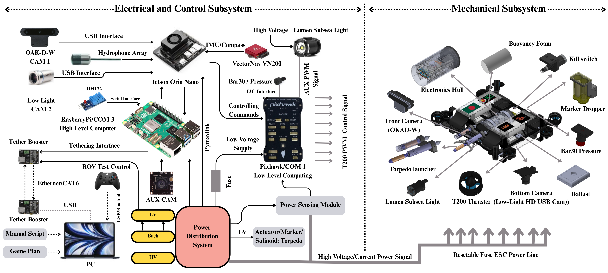

# __ABOUT__
<p align="justify">Hangor 1.0 is Team BengalSub’s debut Autonomous Underwater Vehicle (AUV) for RoboSub 2025, engineered entirely in Bangladesh. Designed for robustness and modularity, Hangor integrates real-time object detection using YOLOv8, acoustic localization, and ROS-based autonomy powered by a Jetson Orin Nano. Built on a CNC-machined aluminum frame with custom watertight enclosures, Hangor features 6-DOF maneuverability, a behavior tree mission planner, and smart subsystems for power, control, and perception. Despite limited local resources, our team successfully developed a fully operational AUV capable of dynamic underwater tasks like gate traversal, marker drop, and trash classification. Hangor reflects our commitment to hands-on innovation, aiming to push forward marine robotics and STEM outreach in Bangladesh.</p>


<hr>

"""
### Thruster Configuration

**Vertical Thrusters (4x):**
- Positioned facing downward
- Diagonal pairs rotate in opposite directions
- Controls: Up/Down, Roll operations

**Horizontal Thrusters (4x):**
- Positioned at 45-degree angles
- Front pair clockwise, back pair counter-clockwise  
- Controls: Forward/Backward, Left/Right, Yaw operations

### Sensors & Components

- **Bar30 Depth Sensor**: Precise depth measurement
- **OAK-D Camera**: Front-facing stereo vision
- **VectorNav IMU**: 6-DOF orientation and motion
- **8x ESCs**: PWM-controlled thruster management
- **YOLOv8 Model**: Fish detection (reef_shark, saw_fish)

## Mission Sequence

1. **Dive Phase**: Descend to 1.5m target depth
2. **Stabilization**: Maintain position for 5 seconds
3. **Detection & Alignment**: Locate fish using vision system
4. **Gate Passage**: Navigate under detected fish
5. **Stabilization**: Brief pause and orientation check
6. **Yaw Rotation**: Execute 720° rotation maneuver
7. **Surface**: Return to surface and system shutdown

## Software Architecture

### Core Modules

- **Main System** (`main.py`): System orchestration and initialization
- **Communication** (`auv/communication/`): Network protocols and telemetry
- **Sensors** (`auv/sensors/`): Multi-sensor data fusion
- **Control** (`auv/control/`): PID controllers and thruster management
- **Vision** (`auv/vision/`): Object detection and tracking
- **Missions** (`auv/missions/`): Autonomous mission execution

### Key Features

- **Asynchronous Architecture**: Non-blocking operation for real-time control
- **PID Control System**: Stabilized depth, yaw, pitch, and roll control
- **Computer Vision**: YOLOv8-based fish detection with confidence filtering
- **Network Communication**: Real-time telemetry and command interface
- **Safety Systems**: Timeout protection and graceful error handling

## Installation & Setup

### Requirements

```bash
pip install asyncio opencv-python ultralytics depthai pyserial RPi.GPIO numpy
```

### Hardware Setup

1. Connect thruster ESCs to designated GPIO pins
2. Configure I2C for Bar30 depth sensor
3. Connect VectorNav IMU via USB/Serial
4. Mount OAK-D camera in forward-facing position
5. Establish network connections per architecture diagram

### Configuration

Edit `config/settings.py` to match your hardware setup:

- Network IP addresses
- GPIO pin assignments  
- Sensor calibration values
- PID controller gains
- Mission parameters

## Usage

### Run Complete Mission
```bash
python main.py
```

### Test Individual Systems
```bash
python scripts/test_systems.py
```

### Launch Mission Script
```bash
python scripts/run_mission.py
```

## Development

### Running Tests
```bash
python -m pytest tests/
```
- Thruster shutdown on mission completion
- Error handling and recovery

## Troubleshooting

**Camera not detected**: System falls back to simulation mode
**Depth control issues**: Check PID parameters in config
**Detection failures**: Verify lighting and water clarity
**Communication errors**: Check hardware connections

## Development

**Add new sensors**:
1. Create sensor class in `auv/sensors/`
2. Implement start/stop methods
3. Add to mission initialization

**Modify mission sequence**:
1. Edit phase methods in `auv/missions/gate_task.py`
2. Adjust timing in configuration
3. Test with simulation mode

## License

Developed for Bengal Sub AUV Team
Educational and research use only
"""

## Communication Architecture:
```
    MacBook ←→ USB-to-Ethernet (USB-C/Thunderbolt) ←→ TLSF1005 Switch ←→ Ethernet Cable(tether) ←→ Jetson Nano (Ethernet port)
```

### Adding New Missions

1. Create mission class in `auv/missions/`
2. Implement required mission steps
3. Add mission to executor sequence
4. Test with simulation environment

## Safety & Operations

### Pre-Mission Checklist

- [ ] All sensors calibrated and responding
- [ ] Thruster functionality verified
- [ ] Network communication established
- [ ] Vision system detecting test objects
- [ ] Emergency stop procedures reviewed

### Operating Procedures

1. **Surface Initialization**: Start all systems at surface
2. **System Check**: Run diagnostic tests
3. **Mission Briefing**: Verify mission parameters
4. **Deployment**: Submerge and begin autonomous operation
5. **Monitoring**: Track telemetry and mission progress
6. **Recovery**: Retrieve AUV upon mission completion

## Troubleshooting

### Common Issues

**Depth Control Oscillation**: Adjust PID gains in config
**Vision Detection Failure**: Check lighting conditions and model confidence thresholds  
**Network Disconnection**: Verify Ethernet connections and IP configuration
**Thruster Malfunction**: Check ESC calibration and PWM signal integrity

### Debug Mode

Enable verbose logging by setting log level to DEBUG in `auv/utils/logger.py`

## Contributing

1. Fork the repository
2. Create feature branch (`git checkout -b feature/new-capability`)
3. Implement changes with tests
4. Submit pull request with detailed description

## License

This project is developed for educational and research purposes in underwater robotics.